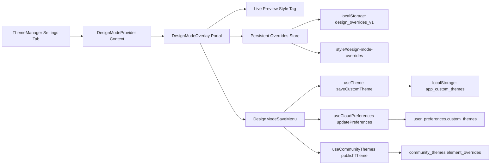
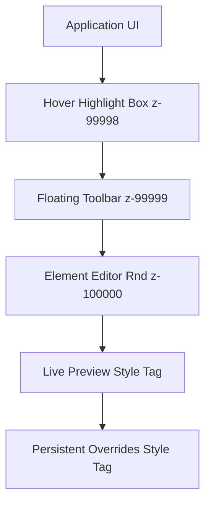
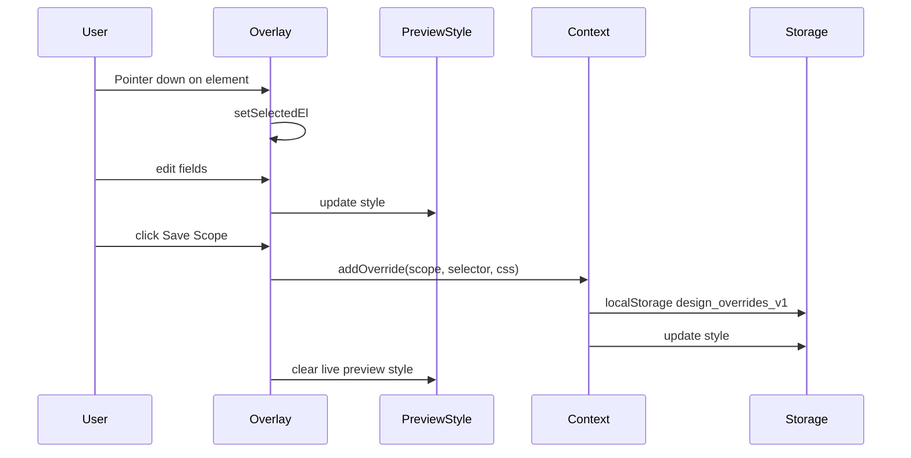
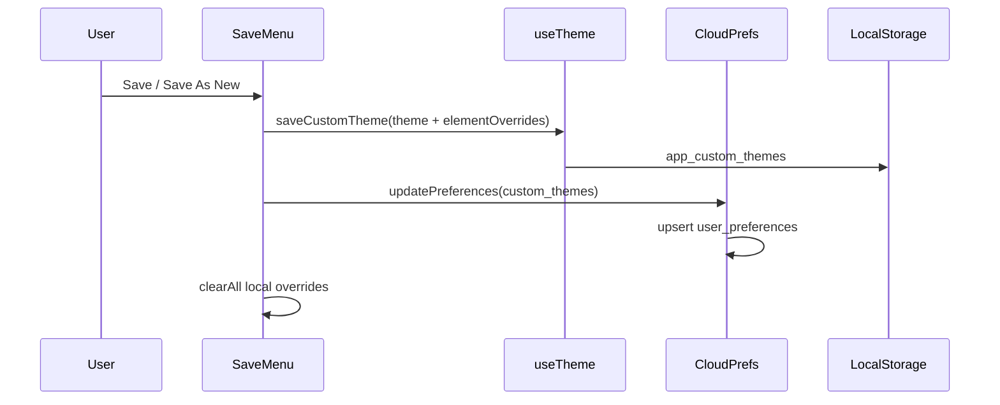

# Live Design Mode - ניתוח עומק מלא לשכפול אחד-לאחד

## מטרת המסמך
המסמך מפרק את מערכת מצב עיצוב חי הקיימת בפרויקט, כדי שתוכל לבנות את אותה מערכת בדיוק בפרויקט אחר.

המסמך כולל:
- ארכיטקטורה מלאה
- כל הפונקציות בפועל
- כל מצבי השמירה (scope save + theme save + cloud)
- מודל נתונים, localStorage, cloud sync
- תרשימי זרימה והמחשות
- פערים בין התכנון המקורי למימוש בפועל
- checklist רפליקציה ו-checklist בדיקות

---

## 1) TL;DR - מה המערכת עושה בפועל

מערכת מצב עיצוב חי מאפשרת:
1. להפעיל מצב עריכה על האפליקציה האמיתית (לא iframe).
2. לרחף ולבחור אלמנטים בדף.
3. לערוך לייב צבעים/טיפוגרפיה/spacing של האלמנט.
4. לראות תצוגה מקדימה מיידית באמצעות style tag זמני.
5. לבחור היקף שמירה (אלמנט ספציפי / סוג אלמנט / כל האתר).
6. לשמור את העיצוב כחלק מערכת נושא (Save/Save As New/Publish).
7. לסנכרן ערכות מותאמות אישית לענן.

---

## 2) מפת ארכיטקטורה



### נקודות חיבור באפליקציה
- עטיפת האפליקציה ב-provider ורינדור overlay:
  - [src/App.tsx](src/App.tsx#L238)
  - [src/App.tsx](src/App.tsx#L240)
- כפתור מצב עיצוב חי בתוך מנהל ערכות נושא:
  - [src/components/ThemeManager.tsx](src/components/ThemeManager.tsx#L19)

---

## 3) רכיבים וקבצי ליבה

## 3.1 DesignModeProvider
קובץ: [src/components/design-mode/DesignModeProvider.tsx](src/components/design-mode/DesignModeProvider.tsx)

אחריות:
- state גלובלי: enabled, overrides
- אתחול overrides מ-localStorage
- הפעלת מצב דרך query param
- undo last, clear all, add override

פונקציות עיקריות:
1. initDesignOverrides + loadOverrides on mount
2. setEnabled לפי URL designMode=1
3. toggle class על body: design-mode-active
4. enforce URL param designMode=1 כאשר enabled=true
5. addOverride(o)
6. undoLast()
7. clearAll()

Context API:
- enabled
- setEnabled
- overrides
- addOverride
- undoLast
- clearAll

---

## 3.2 DesignModeOverlay
קובץ: [src/components/design-mode/DesignModeOverlay.tsx](src/components/design-mode/DesignModeOverlay.tsx)

זה הלב של המערכת.

### State מרכזי
- hoverRect, hoverLabel
- selectedEl
- liveChanges
- selectionKey
- colorFavorites, selectedFavs, deleteMode
- lastFocusedColorProp
- hoveredFavIndex
- eyedropperError
- collapsed
- editorMinimized
- editorSize, editorPosition
- clickPoint

### יכולות מרכזיות
1. יצירת style tag זמני לתצוגה מקדימה live:
   - id: design-mode-live-preview
2. לכידת mousemove/pointerdown/click במסמך כולו (capture=true)
3. מניעת click לפעולות underlying בזמן מצב עיצוב
4. הדגשת hover עם outline + label + swatch של צבע טקסט/רקע
5. בחירת אלמנט ב-pointerdown (לפני onClick של React)
6. פתיחת עורך אלמנט draggable/resizable (Rnd)
7. עריכת שדות:
   - color
   - background-color
   - border-color
   - font-size
   - font-weight
   - border-radius
   - padding
8. EyeDropper API עם fallback error
9. מועדפי צבעים כולל שמירה/מחיקה/בחירה מרובה
10. 3 save scopes מתוך הפאנל
11. כפתורי toolbar:
   - undo
   - collapse
   - clear all
   - save menu
   - exit

### קיצורי מקלדת בזמן מצב עיצוב
- Esc:
  - אם עורך פתוח: סוגר editor
  - אחרת: יוצא ממצב עיצוב
- Ctrl/Cmd + Z:
  - undoLast על הרשומה האחרונה

### Layout persistence
- key: design_mode_editor_layout_v1
- נשמרים width/height/x/y/minimized
- fit to viewport ב-resize

### Color favorites persistence
- key: design_mode_color_favorites_v1
- עד 12 צבעים

---

## 3.3 designOverrides util
קובץ: [src/lib/designOverrides.ts](src/lib/designOverrides.ts)

Model:
- DesignOverride:
  - id
  - scope: element | class | global
  - selector
  - label
  - css: Record<string, string>
  - createdAt

פונקציות:
1. computeSelector(el)
   - עדיפות: id -> data-testid -> nth-child path (עד עומק 6)
2. computeClassSelector(el)
   - tag + עד 6 class names מסוננים
3. describeElement(el)
   - label קצר ל-UI
4. loadOverrides()
5. saveOverrides(list)
6. applyOverridesToDom(list)
   - מייצר CSS עם important
   - style id: design-mode-overrides
7. initDesignOverrides()

storage key:
- design_overrides_v1

---

## 3.4 DesignModeSaveMenu
קובץ: [src/components/design-mode/DesignModeSaveMenu.tsx](src/components/design-mode/DesignModeSaveMenu.tsx)

רמת שמירה שניה: ערכות נושא וענן.

פעולות:
1. Save
   - אם ערכה מובנית/קהילתית: נופל אוטומטית ל-Save As New
   - אחרת: דורס את הערכה המותאמת הפעילה
2. Save As New
   - prompt לשם
   - יוצר custom theme חדש
3. Publish (admin only)
   - מעלה ל-community_themes

כל פעולה כוללת:
- elementOverrides: overrides[] מתוך design mode
- sync custom themes לענן דרך updatePreferences
- clearAll() אחרי save

---

## 3.5 useTheme - מיזוג ערכה + overrides
קובץ: [src/hooks/useTheme.ts](src/hooks/useTheme.ts)

נקודות קריטיות:
1. AppTheme תומך elementOverrides
2. applyThemeToDOM
   - טוקני צבע + style options
3. applyThemeOverrides(theme)
   - merge:
     - theme.elementOverrides
     - localStorage design_overrides_v1
4. בעת setTheme / reapplyActiveTheme
   - מוחל גם theme וגם overrides

---

## 3.6 useCloudPreferences + useCommunityThemes
קבצים:
- [src/hooks/useCloudPreferences.ts](src/hooks/useCloudPreferences.ts)
- [src/hooks/useCommunityThemes.ts](src/hooks/useCommunityThemes.ts)

Cloud side:
1. user_preferences.custom_themes (JSON)
2. סנכרון bidirectional local/cloud
3. conflict resolution לפי app_theme_updated_at

Community side:
1. table: community_themes
2. שדות רלוונטיים:
   - colors
   - style
   - element_overrides
3. publishTheme admin-only

---

## 4) כל פונקציות השמירה - פירוק מלא

## 4.1 שמירה ברמת אלמנט (מתוך הפאנל הצף)

כפתורים:
1. שמור רק על האלמנט הזה
2. שמור על כל האלמנטים מהסוג הזה
3. שמור על כל המופעים בכל האתר

Flow בפועל:
1. בוחר selector לפי scope
2. addOverride
3. saveOverrides -> localStorage + style injection
4. clear live preview
5. closes editor

### חשוב: התנהגות global בפועל
כרגע במימוש, global משתמש באותו selector כמו class:
- ב-applyScope:
  - element => computeSelector
  - אחרת => computeClassSelector

כלומר global לא מבצע map לטוקני ערכה ברמת CSS variables, אלא שומר override סלקטור כמו class scope.

זו נקודה קריטית אם אתה רוצה שכפול 1:1 מול ההתנהגות הנוכחית.

---

## 4.2 שמירה ברמת ערכת נושא (DesignModeSaveMenu)

Save options:
1. Save (overwrite active custom)
2. Save As New
3. Publish (admin)

מה נשמר:
- ערכת נושא כולל elementOverrides
- app_custom_themes בלוקאל
- custom_themes בענן דרך updatePreferences

תוצאה:
- overrides עוברים מ-state זמני לתוך ערכה
- clearAll() מרוקן local overrides לאחר שמירה

---

## 4.3 שמירה לענן

בפועל נשמרים בעיקר:
- theme id
- custom_themes JSON

element overrides עצמם נשמרים כחלק custom_themes (בתוך theme object), לא בשדה ייעודי נפרד ב-user_preferences.

---

## 5) טבלת localStorage מלאה

| Key | תפקיד |
|---|---|
| design_overrides_v1 | רשימת overrides פעילים (persisted css rules) |
| design_mode_editor_layout_v1 | מיקום/גודל/מצב מזעור של עורך האלמנט |
| design_mode_color_favorites_v1 | מועדפי צבעים בפאנל האלמנט |
| app_theme_id | ערכה פעילה |
| app_custom_themes | כל הערכות המותאמות |
| app_community_themes | snapshot של ערכות קהילה |
| app_theme_updated_at | conflict resolution לענן |
| user_preferences | cache מלא של העדפות |

---

## 6) Event / Interaction Matrix

| אירוע | איפה | תוצאה |
|---|---|---|
| mousemove | overlay capture | highlight + label + color chips |
| pointerdown | overlay capture | select element + open editor |
| mousedown/click | overlay capture | swallow כדי למנוע קליקים לאפליקציה |
| Esc | keydown | close editor או exit design mode |
| Ctrl/Cmd+Z | keydown | undoLast override |
| EyeDropper click | editor field | set liveChanges color |
| Save scope button | editor footer | create persistent override |
| Save menu dropdown | toolbar | save theme / new / publish |

---

## 7) המחשות ויזואליות

### 7.1 מצב עיצוב - שכבות UI



### 7.2 flow של בחירת אלמנט ושמירת scope



### 7.3 flow של Save Theme



### 7.4 wireframe toolbar

```text
┌─────────────────────────────────────────────────────────────┐
│ מצב עיצוב חי | undo | collapse | 31 שינויים | clear | שמור | יציאה │
└─────────────────────────────────────────────────────────────┘
```

### 7.5 wireframe editor panel

```text
┌───────────────────────────────────────────────┐
│ עריכת אלמנט: div.space-y-8   [min] [close]   │
├───────────────────────────────────────────────┤
│ מועדפים: [swatches...] (+) save / delete      │
│ צבע טקסט     [color] [value] [eyedropper]     │
│ צבע רקע      [color] [value] [eyedropper]     │
│ צבע מסגרת    [color] [value] [eyedropper]     │
│ גודל טקסט    [value]                           │
│ משקל טקסט    [value]                           │
│ עיגול פינות  [value]                           │
│ ריווח פנימי  [value]                           │
├───────────────────────────────────────────────┤
│ שמור רק על האלמנט הזה                         │
│ שמור על כל האלמנטים מהסוג הזה                 │
│ שמור על כל המופעים בכל האתר                   │
└───────────────────────────────────────────────┘
```

---

## 8) פער תכנון מול מימוש (חשוב לשכפול)

מסמך התכנון הפנימי נמצא ב:
- [.lovable/plan.md](.lovable/plan.md)

פערים עיקריים:
1. תוכנן ScopeDialog נפרד - בפועל נשמר כפאנל footer קבוע בתוך העורך.
2. תוכנן global scope שישנה טוקני ערכה - בפועל global מתנהג כמו class selector override.
3. תוכנן שדה element_overrides ב-user_preferences - בפועל overrides נשמרים בתוך custom_themes.
4. תוכנן drag toolbar - בפועל toolbar קבוע top-left, העורך עצמו draggable.

אם המטרה שלך היא "בדיוק אותו דבר", שכפל את ההתנהגות בפועל, לא את הכוונה המקורית במסמך התכנון.

---

## 9) checklist שכפול אחד-לאחד לפרויקט אחר

1. להוסיף provider + overlay ברמת root app.
2. להוסיף utility של selectors + DOM style injection.
3. להוסיף storage keys זהים והתנהגות persist זהה.
4. לבנות overlay capture events עם swallow בטוח ל-clicks.
5. לבנות editor Rnd עם state מלא (layout/favorites/eyedropper).
6. לממש applyScope עם element/class/global בדיוק כמו היום.
7. לממש save menu עם Save/Save As New/Publish.
8. למזג theme.elementOverrides + local overrides בהחלת theme.
9. לסנכרן custom themes לענן.
10. להוסיף בדיקות E2E של פתיחת editor ומניעת ניווט.

---

## 10) בדיקות רגרסיה מומלצות

Reference test קיים:
- [e2e/design-mode.spec.ts](e2e/design-mode.spec.ts)

תרחישים חשובים:
1. designMode=1 מרים toolbar בכל route מאובטח.
2. click על אלמנט פותח editor תמיד.
3. click במצב עיצוב לא מפעיל ניווט underlying.
4. reload עם designMode=1 נשאר פעיל.
5. apply element/class/global מוסיף override חדש ומעדכן style.
6. Save As New יוצר ערכה חדשה עם overrides.
7. Publish נחסם למי שאינו admin.
8. clear all מנקה style + localStorage.

---

## 11) מיפוי פונקציות לפי קובץ

## App wiring
- DesignModeProvider mount: [src/App.tsx](src/App.tsx#L238)
- DesignModeOverlay mount: [src/App.tsx](src/App.tsx#L240)

## Provider
- Provider entry: [src/components/design-mode/DesignModeProvider.tsx](src/components/design-mode/DesignModeProvider.tsx#L21)
- URL activation: [src/components/design-mode/DesignModeProvider.tsx](src/components/design-mode/DesignModeProvider.tsx#L30)
- enable url sync: [src/components/design-mode/DesignModeProvider.tsx](src/components/design-mode/DesignModeProvider.tsx#L45)
- addOverride: [src/components/design-mode/DesignModeProvider.tsx](src/components/design-mode/DesignModeProvider.tsx#L57)
- undoLast: [src/components/design-mode/DesignModeProvider.tsx](src/components/design-mode/DesignModeProvider.tsx#L62)
- clearAll: [src/components/design-mode/DesignModeProvider.tsx](src/components/design-mode/DesignModeProvider.tsx#L67)

## Overlay
- Overlay entry: [src/components/design-mode/DesignModeOverlay.tsx](src/components/design-mode/DesignModeOverlay.tsx#L113)
- live preview style tag: [src/components/design-mode/DesignModeOverlay.tsx](src/components/design-mode/DesignModeOverlay.tsx#L141)
- own UI guard: [src/components/design-mode/DesignModeOverlay.tsx](src/components/design-mode/DesignModeOverlay.tsx#L237)
- pointer select: [src/components/design-mode/DesignModeOverlay.tsx](src/components/design-mode/DesignModeOverlay.tsx#L258)
- applyScope: [src/components/design-mode/DesignModeOverlay.tsx](src/components/design-mode/DesignModeOverlay.tsx#L321)
- EyeDropper: [src/components/design-mode/DesignModeOverlay.tsx](src/components/design-mode/DesignModeOverlay.tsx#L391)
- toolbar render: [src/components/design-mode/DesignModeOverlay.tsx](src/components/design-mode/DesignModeOverlay.tsx#L444)
- editor render: [src/components/design-mode/DesignModeOverlay.tsx](src/components/design-mode/DesignModeOverlay.tsx#L498)

## Save menu
- SaveMenu entry: [src/components/design-mode/DesignModeSaveMenu.tsx](src/components/design-mode/DesignModeSaveMenu.tsx#L25)
- handleSave: [src/components/design-mode/DesignModeSaveMenu.tsx](src/components/design-mode/DesignModeSaveMenu.tsx#L46)
- handleSaveAsNew: [src/components/design-mode/DesignModeSaveMenu.tsx](src/components/design-mode/DesignModeSaveMenu.tsx#L67)
- handlePublish: [src/components/design-mode/DesignModeSaveMenu.tsx](src/components/design-mode/DesignModeSaveMenu.tsx#L93)

## Overrides util
- model + keys: [src/lib/designOverrides.ts](src/lib/designOverrides.ts#L4)
- computeSelector: [src/lib/designOverrides.ts](src/lib/designOverrides.ts#L19)
- computeClassSelector: [src/lib/designOverrides.ts](src/lib/designOverrides.ts#L43)
- applyOverridesToDom: [src/lib/designOverrides.ts](src/lib/designOverrides.ts#L76)

## Theme/cloud integration
- AppTheme.elementOverrides: [src/hooks/useTheme.ts](src/hooks/useTheme.ts#L60)
- theme + local overrides merge: [src/hooks/useTheme.ts](src/hooks/useTheme.ts#L535)
- ThemeManager design mode button: [src/components/ThemeManager.tsx](src/components/ThemeManager.tsx#L19)
- Open live edit in new page with designMode=1: [src/components/ThemeManager.tsx](src/components/ThemeManager.tsx#L821)
- Cloud update of custom themes: [src/hooks/useCloudPreferences.ts](src/hooks/useCloudPreferences.ts#L406)
- Publish to community_themes: [src/hooks/useCommunityThemes.ts](src/hooks/useCommunityThemes.ts#L67)

---

## 12) החלטת שכפול לפרויקט אחר

אם אתה רוצה מערכת זהה לחלוטין:
1. שמור על 2 שכבות save נפרדות:
   - save scope של overrides
   - save menu של ערכות נושא
2. שמור על 2 style tags:
   - live preview זמני
   - persisted overrides
3. שמור על query param designMode=1 כהפעלה אוטומטית.
4. שכפל את global scope כפי שהוא כרגע (class-based override), גם אם השם מרמז אחרת.

אם תרצה בעתיד לשפר מעבר לזהות מלאה:
- להפוך global scope ל-token edit אמיתי.
- להוסיף redo ל-overrides.
- להפריד history של liveChanges לפני apply.

---

## 13) סיכום

זו מערכת חזקה של inline design editing שמחברת בין:
- עריכה נקודתית ברמת DOM
- ערכות נושא ברמת design system
- persistence מקומי
- סנכרון ענן
- פרסום קהילתי לאדמין

הדבר הכי חשוב בשכפול: להבין שיש כאן שתי מערכות שמירה שונות שעובדות יחד.
