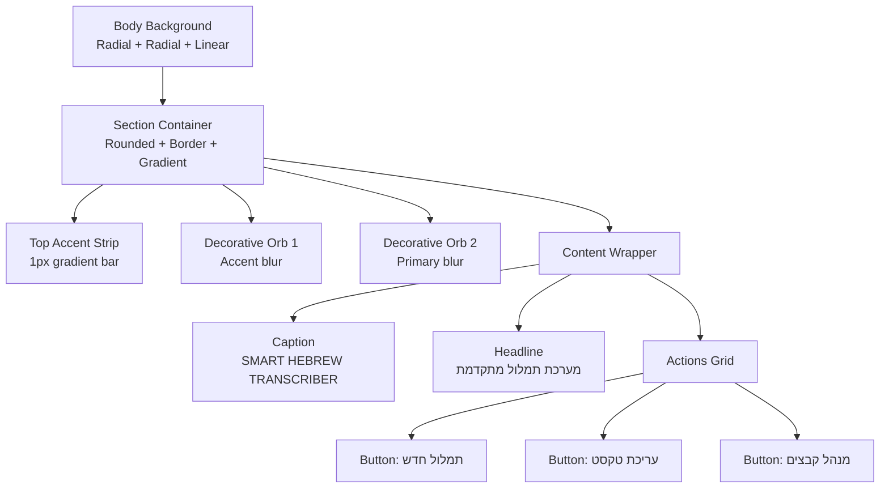
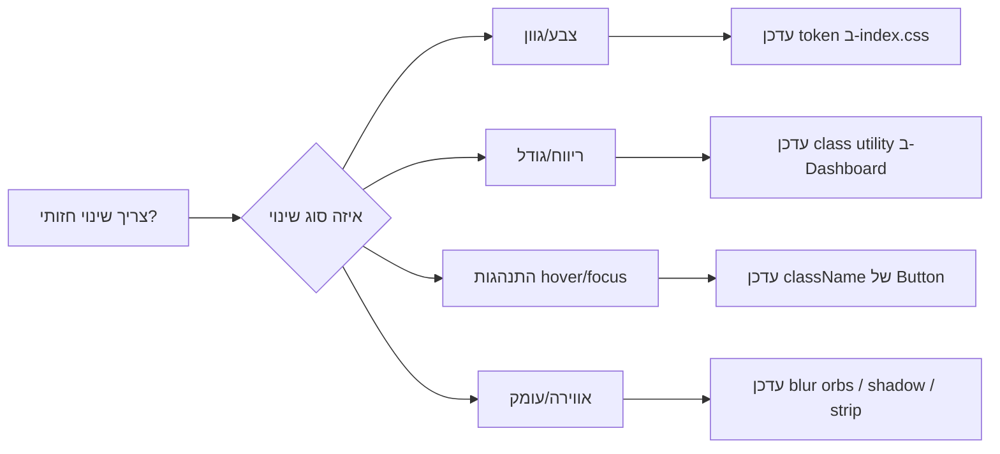

# ניתוח עיצובי מפורט: וידגט הפעולות המהירות

## מטרה והיקף
מסמך זה מנתח לעומק את הווידגט הראשי שמופיע בראש דשבורד התמלול, כולל:
- קומפוזיציית המבנה
- שכבות הרקע
- טוקני צבעים
- פירוק גרדיאנטים
- עיצוב הכפתורים ומצבי אינטראקציה
- טיפוגרפיה
- היררכיה חזותית
- התנהגות רספונסיבית

מקורות הניתוח:
- הרכיב עצמו בקוד הדשבורד
- טוקני העיצוב הגלובליים
- מחלקות רכיב Button הבסיסי
- נתוני אלמנט מפורטים מהדפדפן (HTML/CSS/מידות)

---

## 1) מיקום הווידגט במבנה הדף

הווידגט נמצא כבלוק פעולה ראשי בתוך הדשבורד (Quick Actions), בתוך מעטפת תוכן מרכזית.

מבנה ההקשר:
- מעטפת דף: min-h-screen + רקע גרדיאנט אנכי לפי preset
- מעטפת תוכן: max-w-6xl mx-auto space-y-8
- הווידגט: section עצמאי עם border, gradient, shadow, ואלמנטים דקורטיביים אבסולוטיים

הערה פריסתית חשובה:
- ל-section אין margin-top ישיר
- הרווח העליון הנראה בפועל מגיע מכלל spacing של ההורה:
  .space-y-8 > :not([hidden]) ~ :not([hidden])

---

## 2) אנטומיה מדויקת של הווידגט

### 2.1 שכבת המכולה (Container)
מחלקות ליבה של section:
- relative
- overflow-hidden
- rounded-3xl
- border border-accent/45
- bg-gradient-to-br from-card via-card to-secondary/35
- px-6 py-7
- md:px-10 md:py-10
- shadow-[var(--app-shadow)]
- mb-4 md:mb-6

פירוש חזותי:
- relative + overflow-hidden: מאפשר שכבות אבסולוטיות פנימיות עם חיתוך בקצוות המעוגלים
- rounded-3xl: פינות גדולות ורכות (24px)
- border-accent/45: מסגרת זהובה שקופה חלקית, יוצרת תחושת פרימיום
- גרדיאנט רקע רך מאוד (כמעט שטוח) עם נטייה חמה בתחתית-ימין
- padding נדיב לשמירה על אוויר ועוצמה טיפוגרפית
- shadow עדין מאוד כדי להרים מהמשטח בלי תחושת כרטיס כבד

### 2.2 שכבות דקורטיביות פנימיות
בתוך ה-section יש 3 שכבות דקורטיביות לפני התוכן:

1. פס עליון דק:
- absolute inset-x-0 top-0 h-1
- bg-gradient-to-r from-accent/20 via-accent to-accent/20

תפקיד:
- "חתימה" ויזואלית של המודול
- נקודת פוקוס אופקית שמייצבת את תחילת הכרטיס

2. כתם אור שמאל-עליון:
- absolute -left-12 -top-16 h-44 w-44 rounded-full
- bg-accent/15 blur-3xl

3. כתם אור ימין-תחתון:
- absolute -bottom-16 -right-10 h-40 w-40 rounded-full
- bg-primary/15 blur-3xl

תפקיד משותף:
- יצירת עומק אטמוספרי עדין
- שבירת השטיחות של משטח הכרטיס
- שילוב שני קטבי צבע: accent חם + primary כהה

### 2.3 שכבת התוכן
תוכן אמיתי עטוף ב:
- relative space-y-6

הרכב תוכן:
- בלוק טקסט מרכזי (caption + headline)
- גריד כפתורים: grid gap-3 md:grid-cols-3

---

## 3) ניתוח צבעים וטוקני מערכת

### 3.1 טוקנים מרכזיים (Light Theme)

| Token | HSL | HEX | שימוש מרכזי |
|---|---|---|---|
| background | 40 24% 94% | #f3f1ec | רקעי מסך וכפתורים |
| foreground | 222 52% 14% | #111c36 | טקסט ראשי |
| card | 40 35% 97% | #faf8f5 | בסיס רקע הכרטיס |
| primary | 223 63% 16% | #0f1e43 | צבע מותג כהה, hover פעיל |
| secondary | 40 44% 90% | #f1e9da | טון משלים חם ובהיר |
| accent | 41 72% 47% | #ce9722 | הדגשה זהובה |
| border | 40 40% 72% | #d4c19b | קווי מסגרת רכים |
| input | 40 33% 82% | #e0d6c2 | גבולות קלט/outline default |
| primary-foreground | 43 90% 96% | #fef9ec | טקסט על רקע primary |

### 3.2 שימושי שקיפות קריטיים בווידגט
- border-accent/45 = rgba(206, 151, 34, 0.45)
- to-secondary/35 = rgba(241, 233, 218, 0.35)
- bg-accent/15 = rgba(206, 151, 34, 0.15)
- bg-primary/15 = rgba(15, 30, 67, 0.15)
- bg-background/70 = rgba(243, 241, 236, 0.70)
- border-primary/25 = rgba(15, 30, 67, 0.25)

### 3.3 קריאת הכוונה האמנותית
הפלטה מחברת שני עולמות:
- עולם "חם-מסורתי": גווני שמנת וזהב
- עולם "טכנולוגי-יציב": navy עמוק

התוצאה:
- מוצר מרגיש מקצועי ורציני
- אבל עדיין מזמין ולא סטרילי

---

## 4) פירוק גרדיאנטים: דף + וידגט

## 4.1 רקע הדף (Body)
רקע גלובלי בנוי משלוש שכבות:

1. radial-gradient ב-9% 12% עם accent/0.09 עד transparent 38%
2. radial-gradient ב-87% 10% עם primary/0.08 עד transparent 44%
3. linear-gradient אנכי 180deg של background מלא

משמעות עיצובית:
- אין flat color קשיח
- יש "אוויר צבעוני" עדין בקצוות העליונים
- המרכז נשאר נקי לקריאות גבוהה

### 4.2 רקע הווידגט עצמו (Section)
הגרדיאנט הראשי:
- direction: to bottom right
- stops:
  - from: card מלא
  - via: card מלא (עצירה נוספת באותו צבע)
  - to: secondary/35

משמעות:
- רוב הכרטיס נשמר בגוון card אחיד יחסית
- המעבר המשמעותי מתרחש בעיקר בפינה הימנית-תחתונה
- זהו גרדיאנט "מתוחכם-שקט", לא אפקט צעקני

### 4.3 פס העליון
גרדיאנט אופקי:
- from accent/20
- via accent/100
- to accent/20

זה יוצר highlight שמרגיש כמו פס מתכתי מואר במרכז.

---

## 5) טיפוגרפיה והיררכיית תוכן

### 5.1 משפחת פונט והתנהגות גלובלית
body משתמש במשתני נושא:
- font-family: var(--app-font-family)
- font-size: var(--app-font-size)
- font-weight: var(--app-font-weight)

במצב הנוכחי שנמדד:
- font-family בפועל: Assistant
- font-size בסיסי: 15px
- font-weight בסיסי: 500
- כיוון מסמך: rtl

### 5.2 טקסטים בווידגט

Caption עליון:
- text-xs
- font-semibold
- tracking-[0.2em]
- text-primary/70
- טקסט לטיני באותיות גדולות, יוצר תחושת מוצר גלובלי

Headline ראשי:
- text-3xl md:text-5xl
- font-black
- leading-tight
- text-accent
- מספק עוגן ויזואלי חד וברור, עם קונטרסט חם מול הרקע הקרמי

### 5.3 היררכיה
סדר קשב טיפוסי:
1. כותרת זהובה גדולה
2. פס עליון עדין
3. שורת כפתורים אחידה
4. caption באנגלית

היררכיה זו מייצרת זיהוי מהיר של "מה זה המסך" ואחריו "מה לעשות עכשיו".

---

## 6) עיצוב הכפתורים: שכבת בסיס + Override מקומי

כל 3 הכפתורים מבוססים על רכיב Button עם variant="outline".

### 6.1 בסיס Button (outline)
המחלקות הבסיסיות של outline כוללות:
- border border-input
- bg-background
- hover:bg-accent
- hover:text-accent-foreground

בנוסף, לכל הכפתורים:
- transition-colors
- focus-visible ring
- disabled states
- inline-flex + icon sizing מובנה

### 6.2 Override ספציפי בווידגט
כל כפתור מקבל className נוסף:
- h-12
- justify-center
- border-primary/25
- bg-background/70
- text-foreground
- hover:bg-primary
- hover:text-primary-foreground

משמעות מעשית:
- גבול עדין כהה יותר מה-outline הדיפולטי
- רקע חלבי שקוף שמתחבר לכרטיס
- במעבר עכבר: כפתור הופך ל-primary כהה עם טקסט בהיר

### 6.3 מידות וקצב
- גובה קבוע h-12 לכל הכפתורים
- gap פנימי 2 בין אייקון לטקסט
- icon בגודל 16x16
- ב-desktop: 3 עמודות שוות
- ב-mobile: עמודה אחת רציפה

### 6.4 רספונסיביות תפקודית
- md:grid-cols-3: מדגיש פעולה מהירה מקבילה
- ללא md: סטאק אנכי, נוח ללחיצה במסכי מגע

### 6.5 הערה על צבע האייקונים
קיים כלל גלובלי:
- svg:not(.no-theme-icon) { color: hsl(var(--primary)); }

לכן אייקוני Lucide מקבלים צבע primary באופן ישיר.
משמעות אפשרית:
- גם כאשר הכפתור נכנס ל-hover עם text-primary-foreground,
  האייקון עלול להישאר primary אם לא מבוטל הכלל הגלובלי או לא מתווסף no-theme-icon.

---

## 7) עומק, צל ושכבות

### 7.1 צל הכרטיס
--app-shadow מוגדר גלובלית כצל עדין מאוד:
- 0 1px 3px rgb(0 0 0 / 0.06)

בפועל בדפדפן נמדד שילוב עדין בסגנון חומרי קל:
- 0 1px 3px 0 rgb(0 0 0 / 0.06), 0 1px 2px -1px rgb(0 0 0 / 0.06)

### 7.2 למה זה עובד
- הגבול הזהוב הדק + הצל המינימלי
- כתמי blur גדולים באופסיטי נמוך

שלישייה זו מייצרת depth בלי להפוך את הכרטיס ל"כבד" או מודגש מדי.

---

## 8) מידות ונתוני רינדור שנמדדו

לפי הקונטקסט המצורף:
- רוחב אלמנט: 889px
- גובה כולל שנמדד: 258px (עם תוכן ופנימיות)
- border-radius: 24px
- border: 1px solid rgba(206, 151, 34, 0.45)

Padding רספונסיבי:
- desktop: 40px לכל צד (md:px-10 md:py-10)
- mobile: 24px אופקי, 28px אנכי (px-6 py-7)

---

## 9) דפוס סגנוני כולל (Design DNA)

זהו וידגט "Hero Action Panel" עם זהות ברורה:
- Warm Editorial: רקע שמנתי, זהב עדין, טיפוגרפיה בולטת
- Productive Utility: 3 פעולות חדות ומיידיות
- Calm Depth: שכבות אור מטושטשות וצל מינימלי
- RTL-First: יישור ושפה מותאמים לממשק עברי

הוא משדר:
- מקצועיות
- בהירות פעולה
- זהות מותג לא גנרית

---

## 10) מפת מחלקות קצרה לפי אזורים

Section:
- relative overflow-hidden rounded-3xl border border-accent/45
- bg-gradient-to-br from-card via-card to-secondary/35
- px-6 py-7 md:px-10 md:py-10
- shadow-[var(--app-shadow)] mb-4 md:mb-6

Decorations:
- top strip: absolute inset-x-0 top-0 h-1 bg-gradient-to-r from-accent/20 via-accent to-accent/20
- orb 1: absolute -left-12 -top-16 h-44 w-44 rounded-full bg-accent/15 blur-3xl
- orb 2: absolute -bottom-16 -right-10 h-40 w-40 rounded-full bg-primary/15 blur-3xl

Typography:
- caption: text-xs font-semibold tracking-[0.2em] text-primary/70
- headline: text-3xl md:text-5xl font-black leading-tight text-accent

Buttons:
- grid: gap-3 md:grid-cols-3
- item: h-12 justify-center border-primary/25 bg-background/70 text-foreground hover:bg-primary hover:text-primary-foreground

---

## 11) סיכום מקצועי חד

הווידגט בנוי בצורה מדויקת מאוד לשילוב בין:
- חזות פרימיום חמה
- שימושיות תפעולית מהירה
- נוכחות מותגית ברורה

הכוח העיצובי מגיע בעיקר מהאיזון:
- מעט צבעים, הרבה היררכיה
- גרדיאנטים עדינים במקום אפקטים חדים
- כותרת אמיצה + כפתורים שקטים אך ברורים

זה מודול מוצלח של Hero Utility: גם מרשים וגם פרקטי.

---

## 12) המחשות ויזואליות למפתח

הסעיף הזה נועד לקצר זמן הבנה בפיתוח בפועל: לראות את השכבות, הסדר והמצבים בלי לפרש טקסט ארוך.

### 12.1 דיאגרמת שכבות (Layer Stack)



### 12.2 Wireframe מבני (Desktop)

```text
┌──────────────────────────────────────────────────────────────────────────────┐
│  accent strip (top highlight)                                                │
│                                                                              │
│        SMART HEBREW TRANSCRIBER                                              │
│                 מערכת תמלול מתקדמת                                            │
│                                                                              │
│  ┌────────────────┐ ┌────────────────┐ ┌────────────────┐                   │
│  │   תמלול חדש     │ │   עריכת טקסט   │ │   מנהל קבצים   │                   │
│  └────────────────┘ └────────────────┘ └────────────────┘                   │
│                                                                              │
└──────────────────────────────────────────────────────────────────────────────┘
```

### 12.3 Wireframe מבני (Mobile)

```text
┌──────────────────────────────┐
│ accent strip                 │
│ SMART HEBREW TRANSCRIBER     │
│ מערכת תמלול מתקדמת            │
│ ┌──────────────────────────┐ │
│ │ תמלול חדש                │ │
│ └──────────────────────────┘ │
│ ┌──────────────────────────┐ │
│ │ עריכת טקסט               │ │
│ └──────────────────────────┘ │
│ ┌──────────────────────────┐ │
│ │ מנהל קבצים               │ │
│ └──────────────────────────┘ │
└──────────────────────────────┘
```

### 12.4 מפת צבעים חזותית (Swatches)

| Token | Preview | HEX | תפקיד |
|---|---|---|---|
| background | <span style="display:inline-block;width:76px;height:18px;border:1px solid #c7c7c7;background:#f3f1ec;"></span> | #f3f1ec | רקע מסך/כפתור |
| card | <span style="display:inline-block;width:76px;height:18px;border:1px solid #c7c7c7;background:#faf8f5;"></span> | #faf8f5 | בסיס הווידגט |
| secondary | <span style="display:inline-block;width:76px;height:18px;border:1px solid #c7c7c7;background:#f1e9da;"></span> | #f1e9da | תחנת הגרדיאנט הסופית |
| accent | <span style="display:inline-block;width:76px;height:18px;border:1px solid #c7c7c7;background:#ce9722;"></span> | #ce9722 | כותרת/הדגשה |
| primary | <span style="display:inline-block;width:76px;height:18px;border:1px solid #c7c7c7;background:#0f1e43;"></span> | #0f1e43 | Hover פעיל ואייקונים |
| foreground | <span style="display:inline-block;width:76px;height:18px;border:1px solid #c7c7c7;background:#111c36;"></span> | #111c36 | טקסט רגיל |

### 12.5 גרדיאנט הווידגט כהמחשה רציפה

```text
from card (#faf8f5)  ───────────── via card (#faf8f5) ────────▶ to secondary/35
             (מרכז הכרטיס נשאר בהיר ונקי)
```

כיוון:
- אלכסון מעלה-שמאל אל מטה-ימין

תחושה:
- כרטיס "כמעט אחיד" עם הטיה חמה בפינה הימנית-תחתונה

### 12.6 מצבי כפתור (State Visual)

```mermaid
stateDiagram-v2
  [*] --> Default
  Default: bg=background/70
  Default: border=primary/25
  Default: text=foreground

  Default --> Hover: mouseenter
  Hover: bg=primary
  Hover: text=primary-foreground

  Default --> FocusVisible: keyboard tab
  FocusVisible: ring-2 + ring-offset-2

  Hover --> Default: mouseleave
  FocusVisible --> Default: blur
```

### 12.7 מקרא שכבות לפי Z-Order

```text
Z גבוה
  [תוכן טקסט + כפתורים]     relative
  [פס עליון]                 absolute
  [כתם Accent מטושטש]        absolute
  [כתם Primary מטושטש]       absolute
  [רקע Section + Border]     base
  [רקע הדף]                  base
Z נמוך
```

### 12.8 מפת ריווחים מהירה (Spacing Cheat Sheet)

| אזור | Mobile | Desktop (md+) |
|---|---|---|
| Section padding-x | 24px | 40px |
| Section padding-y | 28px | 40px |
| Gap בין בלוקי תוכן | 24px | 24px |
| Gap בין הכפתורים | 12px | 12px |
| Button height | 48px | 48px |
| Container max width | לפי shell | max-w-6xl (או max-w-7xl ב-compact) |

### 12.9 תרשים קבלת החלטות מהיר למפתח



### 12.10 בדיקות ויזואליות מומלצות לפני merge

1. Desktop 1440px: הכותרת נשארת במרכז והכפתורים בקו אחד.
2. Tablet 768px: מעבר ל-grid תלת-עמודי נשמר, ללא שבירת טקסט בכפתורים.
3. Mobile 390px: כל הכפתורים נערמים אנכית וריווח נשאר מאוורר.
4. Hover/Focus: ניגודיות טקסט מספיקה על רקע primary.
5. Dark theme (אם מופעל): הכותרת והפס העליון לא צורבים, והצל לא נעלם.
